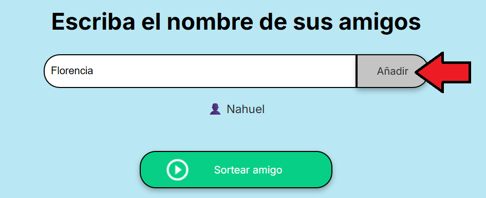

# <h1 align="center">Amigo Secreto</h1>

<p>Este es un ejercicio realizado para el curso de ORACLE NEXT EDUCACION mediante la plataforma Alura Latam.</p>

<p> Se trata de un proyecto web simple e interactivo para organizar un <b>Amigo Secreto</b> de manera rapida y divertida. Permite agregar nombres de los participantes a una lista y luego sortear un nombre al azar.</p>

## Características principales
- Agregar nombres de los participantes.
- Ver la lista completa de amigos añadidos. 
- Sortear un amigo al azar con un solo click.
- Interfaz amigable yh minimalista hecha con **HTML, CSS y JavaScript.**

## Utilización

**Pagina de Inicio**

- Cuando ingreses al navegador, se debe observar de esta manera.


<p></p>

**Insertar los Participantes a la lista**
- Escribiremos cada nombre que querramos y pondremos añadir, de esta manera, los nombres participes se iran añadiendo a la lista para su posterior sorteo.



**Realización del sorteo**
- Una vez terminado de cargar la cantidad de nombres que participen se debe dar click en <b>Sortear Amigo</b> y automaticamente te mostrará el resultado.


## Instalación y Uso

1. Abre Git en tu computadora y selecciona tu escritorio con el comando.  
  `cd`

2. Copia el link de este repositorio y en git escribe el comando. 
  
```
git clone (https://github.com/NahuelGutman/Challenge-del-amigo-secreto.git) 
```
3. Abrir el archivo ``index.html`` en tu navegador favorito.

4. <b>¡Listo! ya podés empezar a jugar.</b>
